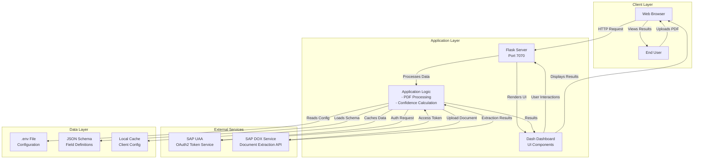
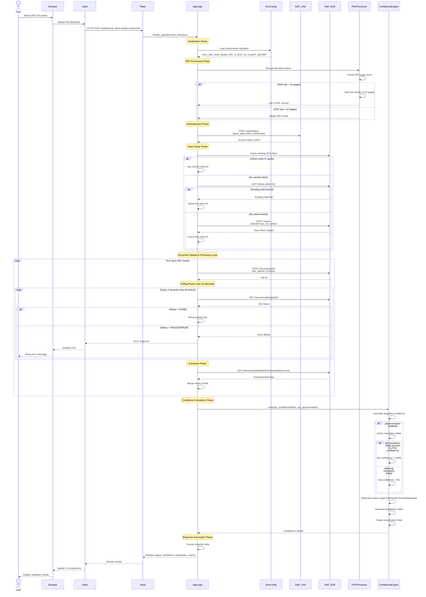
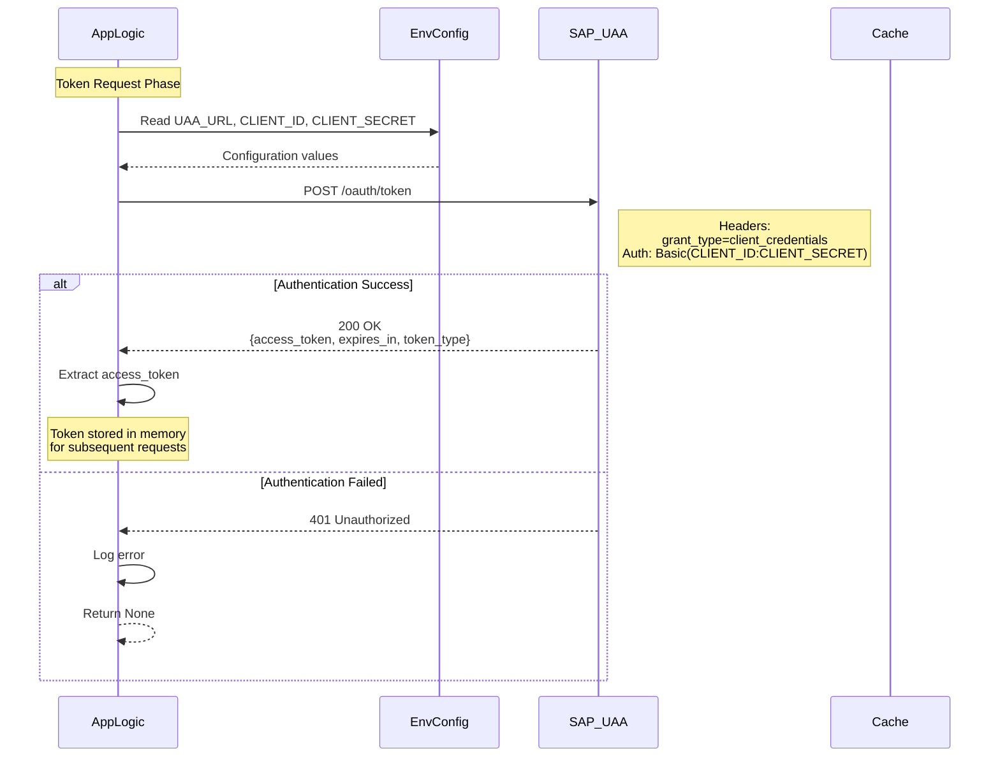
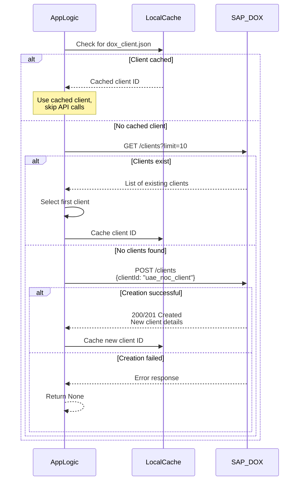
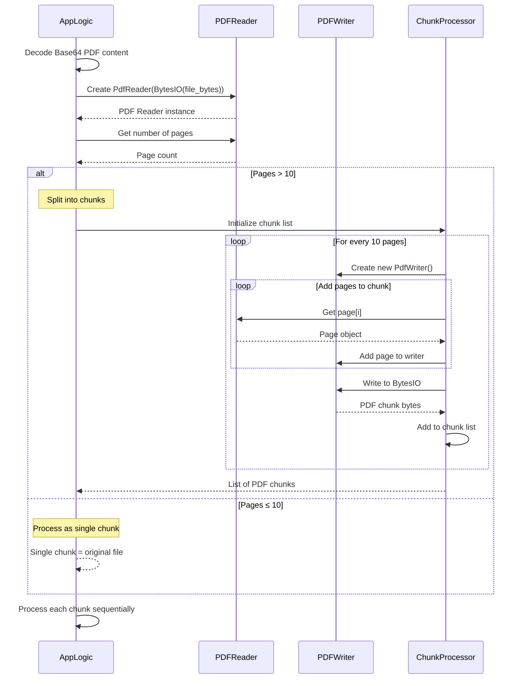
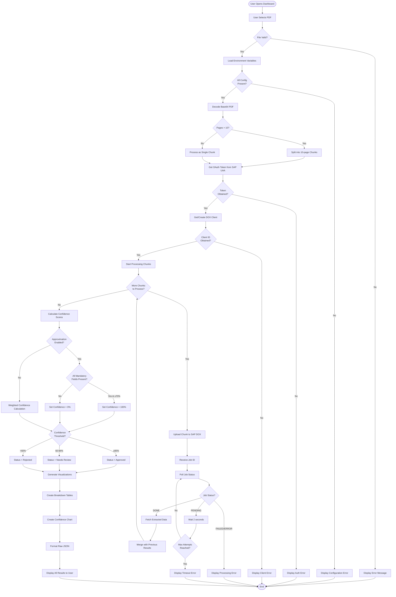
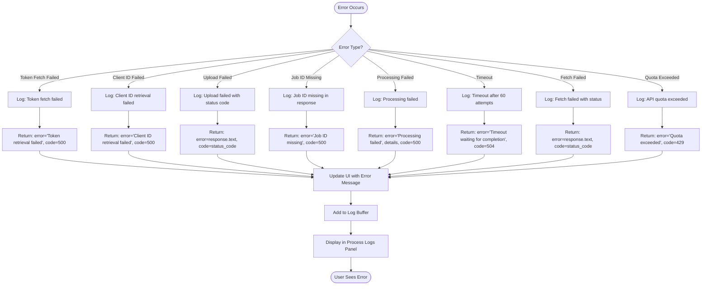
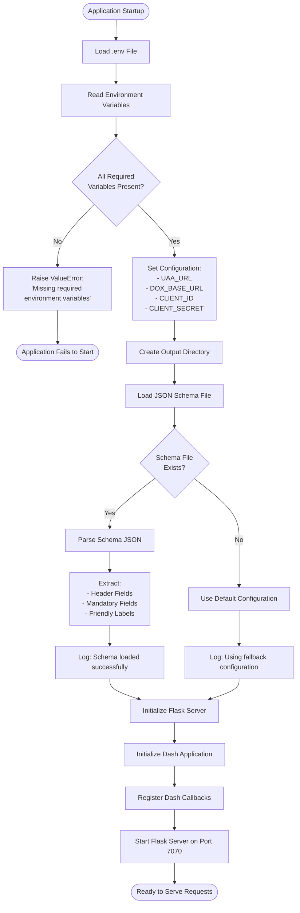
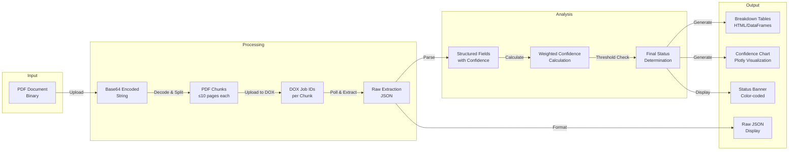
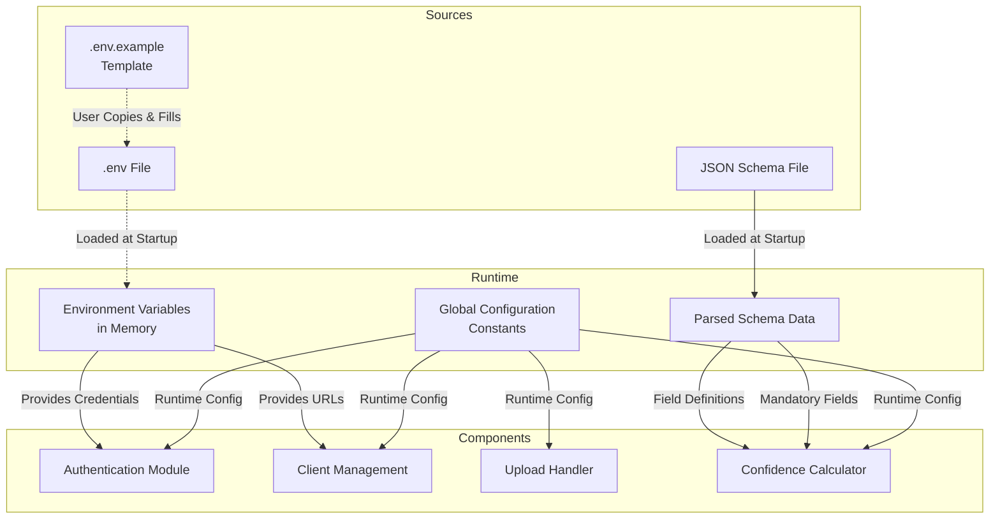

# UAE NOC Validator - Architecture & Flow Diagrams

## Table of Contents
1. [System Architecture](#system-architecture)
2. [Sequence Diagrams](#sequence-diagrams)
3. [Activity Diagrams](#activity-diagrams)
4. [Data Flow](#data-flow)

---

## System Architecture



---

## Sequence Diagrams

### 1. Complete Document Upload and Validation Flow



### 2. Authentication Flow



### 3. DOX Client Management Flow



### 4. PDF Processing Flow



---

## Activity Diagrams

### 1. Complete Application Workflow



### 2. Confidence Calculation Workflow

```mermaid
flowchart TD
    Start([Start Confidence Calculation]) --> InitVars[Initialize Variables:<br/>- total_conf = 0<br/>- breakdown = []]
    
    InitVars --> LoadFields[Load ALL_FIELDS from Schema]
    LoadFields --> DefineWeights[Define Weighted Subset:<br/>- applicationNumber: 20%<br/>- issuingAuthority: 20%<br/>- ownerName: 20%<br/>- issueDate: 20%<br/>- documentStatus: 20%]
    
    DefineWeights --> LoopFields{For Each<br/>Field}
    
    LoopFields -->|Next Field| GetFieldData[Get Field Data from Extraction]
    GetFieldData --> ExtractConf[Extract Confidence Value]
    ExtractConf --> ExtractValue[Extract Field Value]
    
    ExtractValue --> CheckWeighted{Field in<br/>Weighted Subset?}
    
    CheckWeighted -->|Yes| CalcContrib[Calculate:<br/>contribution = confidence × weight]
    CalcContrib --> AddToTotal[total_conf += contribution]
    AddToTotal --> SetColorGreen[Row Color = Light Green]
    
    CheckWeighted -->|No| ZeroContrib[contribution = 0]
    ZeroContrib --> SetColorGrey[Row Color = Light Grey]
    
    SetColorGreen --> AddBreakdown
    SetColorGrey --> AddBreakdown[Add to Breakdown Array]
    
    AddBreakdown --> LoopFields
    
    LoopFields -->|All Done| CheckApprox{Approximation<br/>Mode Enabled?}
    
    CheckApprox -->|No| RoundConf[Round total_conf to 3 decimals]
    RoundConf --> ReturnResults
    
    CheckApprox -->|Yes| CheckMandatory[Check ALL Mandatory Fields]
    CheckMandatory --> AllPresent{All Present?}
    
    AllPresent -->|No| SetZero[Set total_conf = 0%]
    SetZero --> ReturnResults
    
    AllPresent -->|Yes| CheckConfidence{All ≥70%<br/>Confidence?}
    
    CheckConfidence -->|Yes| SetHundred[Set total_conf = 100%]
    CheckConfidence -->|No| KeepCalc[Keep Calculated Confidence]
    
    SetHundred --> ReturnResults
    KeepCalc --> ReturnResults[Return: total_conf, breakdown]
    
    ReturnResults --> End([End])
```

### 3. Error Handling Workflow



### 4. Startup and Configuration Flow



---

## Data Flow

### 1. Data Transformation Pipeline



### 2. Configuration Data Flow



---

## Integration Points

### SAP Services Integration

```mermaid
graph LR
    subgraph "Application"
        App[UAE NOC Validator]
    end
    
    subgraph "SAP BTP"
        UAA[UAA Service<br/>OAuth2 Authentication]
        DOX[DOX Service<br/>Document Extraction]
    end
    
    App -->|1. POST /oauth/token<br/>grant_type=client_credentials| UAA
    UAA -->|2. access_token| App
    App -->|3. GET /clients<br/>Authorization: Bearer token| DOX
    App -->|4. POST /clients<br/>Authorization: Bearer token| DOX
    App -->|5. POST /document/jobs<br/>file + options| DOX
    DOX -->|6. Job ID| App
    App -->|7. GET /document/jobs/{id}<br/>Poll for status| DOX
    DOX -->|8. Status updates| App
    App -->|9. GET /document/jobs/{id}<br/>extractedValues=true| DOX
    DOX -->|10. Extracted field data| App
```

---

## Component Responsibilities

### Backend Components

| Component | Responsibilities | Dependencies |
|-----------|-----------------|--------------|
| **Flask Server** | - HTTP request handling<br/>- Route management<br/>- WSGI application | - Python 3.8+<br/>- Flask 3.0.3 |
| **Dash Application** | - UI rendering<br/>- Callback management<br/>- Component updates | - Dash 2.17.0<br/>- Plotly 5.24.1 |
| **Authentication Module** | - OAuth2 token retrieval<br/>- Token management | - requests 2.31.0<br/>- SAP UAA |
| **Client Manager** | - DOX client creation<br/>- Client ID caching | - requests 2.31.0<br/>- Local file system |
| **PDF Processor** | - PDF parsing<br/>- Page splitting<br/>- Chunk generation | - PyPDF2 3.0.1 |
| **Upload Handler** | - File upload processing<br/>- DOX job submission<br/>- Status polling | - requests 2.31.0<br/>- SAP DOX |
| **Confidence Engine** | - Weighted calculations<br/>- Approximation logic<br/>- Status determination | - pandas 2.2.3 |
| **Visualization Generator** | - Chart generation<br/>- Table formatting<br/>- JSON formatting | - plotly 5.24.1<br/>- pandas 2.2.3 |

---

## Performance Considerations

### Optimization Points

1. **Token Caching**: OAuth tokens are stored in memory for the application lifetime
2. **Client ID Caching**: DOX client IDs are cached to local file system
3. **Chunk Processing**: Sequential processing to avoid quota limits
4. **Polling Optimization**: 2-second intervals with max 60 attempts (2 minutes)
5. **PDF Splitting**: Automatic chunking for large documents (>10 pages)

### Scalability Limits

| Resource | Limit | Impact |
|----------|-------|--------|
| **PDF Pages** | 10 pages per chunk | Large PDFs require multiple API calls |
| **Processing Time** | ~10-50 seconds per chunk | User must wait for sequential processing |
| **API Quota** | SAP DOX trial limits | May fail on bulk uploads |
| **Memory** | PDF size dependent | Large PDFs increase memory usage |

---

**Document Version**: 1.0  
**Last Updated**: November 2025  
**Author**: UAE NOC Validator Development Team
